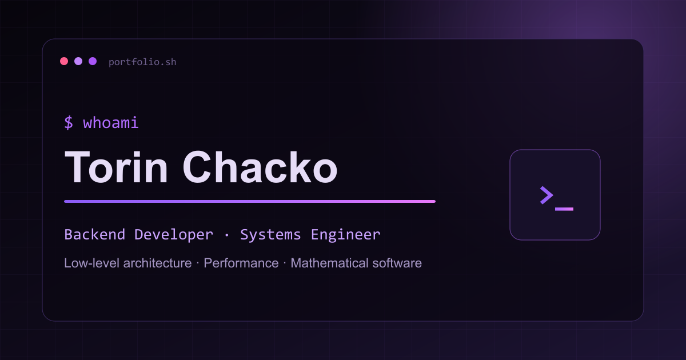

# Torin Chacko — Portfolio

[](https://github.com/TorinChacko/torinchacko.github.io/actions/workflows/validate-site.yml)

Personal portfolio for backend, systems, and performance-engineering work, served with GitHub Pages at [torinchacko.github.io](https://torinchacko.github.io/).



## Highlights

- Experience and education timeline
- Evidence-focused project case studies
- Responsive, accessible, reduced-motion-aware interface
- Automated résumé compilation and site validation

## Structure

```
index.html              site markup
assets/css/style.css    styles
assets/js/main.js       interactions (nav, scroll reveal, typing effect, particles)
assets/images/          social and preview graphics
resume/resume.tex       resume source
resume/resume.pdf       compiled resume (auto-built, do not edit by hand)
scripts/check-site.mjs  local-reference and metadata validation
```

## Local preview

Run a static server from the repository root:

```powershell
python -m http.server 8777
```

Then open `http://localhost:8777`. Run the repository checks with:

```powershell
node --check assets/js/main.js
node scripts/check-site.mjs
```

## Updating the resume

Edit `resume/resume.tex` and push to `main`. A GitHub Actions workflow
(`.github/workflows/build-resume.yml`) compiles it with LaTeX and commits the
resulting `resume/resume.pdf` back to the repo automatically. No local LaTeX
install required.
